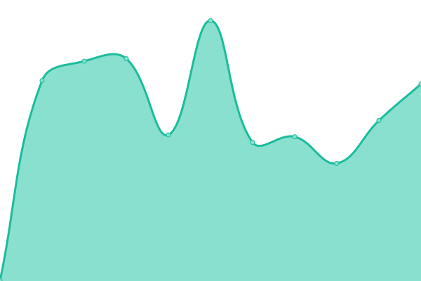
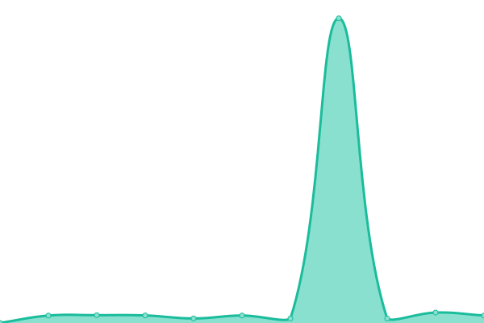

# [📈 Live Status](https://status.particulier.api.gouv.fr): <!--live status--> **🟧 Partial outage**

This repository contains the open-source uptime monitor and status page for [beta.gouv.fr](https://beta.gouv.fr), powered by [Upptime](https://github.com/upptime/upptime).

With [Upptime](https://upptime.js.org), you can get your own unlimited and free uptime monitor and status page, powered entirely by a GitHub repository. We use [Issues](https://github.com/betagouv/api-particulier-status/issues) as incident reports, [Actions](https://github.com/betagouv/api-particulier-status/actions) as uptime monitors, and [Pages](https://status.particulier.api.gouv.fr) for the status page.

<!--start: status pages-->
<!-- This summary is generated by Upptime (https://github.com/upptime/upptime) -->
<!-- Do not edit this manually, your changes will be overwritten -->
<!-- prettier-ignore -->
| URL | Status | History | Response Time | Uptime |
| --- | ------ | ------- | ------------- | ------ |
|  [API Particulier](https://particulier.api.gouv.fr/api/ping) | Opérationnel | [api-particulier.yml](https://github.com/betagouv/api-particulier-status/commits/HEAD/history/api-particulier.yml) | 

 707ms
     
 | 

<a href="https://status.particulier.api.gouv.fr/history/api-particulier">100.00%</a>
    

|  [API CNAF](https://particulier.api.gouv.fr/api/caf/ping) | Opérationnel | [api-cnaf.yml](https://github.com/betagouv/api-particulier-status/commits/HEAD/history/api-cnaf.yml) | 

 3233ms
     
 | 

<a href="https://status.particulier.api.gouv.fr/history/api-cnaf">100.00%</a>
    

|  Endpoint CNAF v1 | Opérationnel | [endpoint-cnaf-v1.yml](https://github.com/betagouv/api-particulier-status/commits/HEAD/history/endpoint-cnaf-v1.yml) | 

 155ms
     
 | 

<a href="https://status.particulier.api.gouv.fr/history/endpoint-cnaf-v1">100.00%</a>
    

|  Endpoint CNAF v2 | Opérationnel | [endpoint-cnaf-v2.yml](https://github.com/betagouv/api-particulier-status/commits/HEAD/history/endpoint-cnaf-v2.yml) | 

 131ms
     
 | 

<a href="https://status.particulier.api.gouv.fr/history/endpoint-cnaf-v2">100.00%</a>
    

|  Endpoint DGFIP v1 | Indisponible | [endpoint-dgfip-v1.yml](https://github.com/betagouv/api-particulier-status/commits/HEAD/history/endpoint-dgfip-v1.yml) | 

 645ms
     
 | 

<a href="https://status.particulier.api.gouv.fr/history/endpoint-dgfip-v1">0.00%</a>
    

|  Endpoint DGFIP v2 | Indisponible | [endpoint-dgfip-v2.yml](https://github.com/betagouv/api-particulier-status/commits/HEAD/history/endpoint-dgfip-v2.yml) | 

 464ms
     
 | 

<a href="https://status.particulier.api.gouv.fr/history/endpoint-dgfip-v2">0.00%</a>
    

|  [API DGFIP](https://particulier.api.gouv.fr/api/impots/ping) | Indisponible | [api-dgfip.yml](https://github.com/betagouv/api-particulier-status/commits/HEAD/history/api-dgfip.yml) | 

 5644ms
     
 | 

<a href="https://status.particulier.api.gouv.fr/history/api-dgfip">100.00%</a>
    

<!--end: status pages-->

[**Visit our status website →**](https://status.particulier.api.gouv.fr)

## 📄 License

- Powered by: [Upptime](https://github.com/upptime/upptime)
- Code: [MIT](./LICENSE) © [beta.gouv.fr](https://beta.gouv.fr)
- Data in the `./history` directory: [Open Database License](https://opendatacommons.org/licenses/odbl/1-0/)
